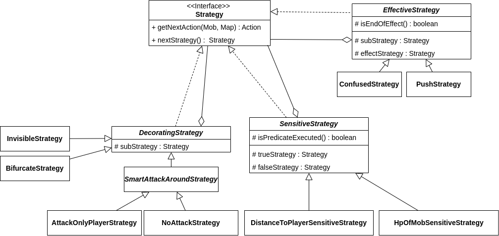
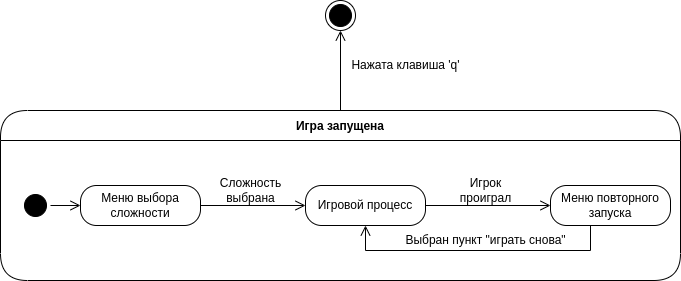

# For the win. Rogue-like game
Игра свободно распространяется и предназначена для организации игрового процесса (геймплея) и выступающая в качестве партнёра по игре. Пользователями могут быть любые лица, загрузившие исполняемый файл игры.

# Содержание
1. [Описание геймплея и ключевых идей](#description)
2. [Термины и определения](#dictionary)
3. [Технические детали](#tech)
4. [Architectural drivers](#arch)
5. [Роли и случаи использования](#role)


Документы с uml-диаграммами доступны в папке src и по [ссылке](https://drive.google.com/file/d/1-Kyv6zulRddlxvYu2PO-sJDKGJtXorRm/view?usp=sharing) на diagrams.net


# 1. Описание геймплея и ключевых идей <a name="description"></a>

Игрок передвигается по двухмерной карте, на которой расположены стены, враги и предметы. Игрок собирает предметы, 
чтобы повышать свои характеристики и эффективнее сражаться с врагами. Враги постоянно появляются в случайных точках карты.

На карте есть порталы, которые позволяют перейти на другую карту. 
Следующая карта будет населена более сильными врагами и более мощными предметами. Назад пройти нельзя.

Цель игры - пройти как можно большее количество карт. Сохранять игру и загружать сохранения нельзя, каждый раз игра начинается с первого уровня.

# 2. Термины и определения <a name="dictionary"></a>
## Общие термины
### Сессия (`Session`)
Процесс игры с первого уровня до смерти (достижения нулевого уровня здоровья) главного персонажа.

### Уровень (`Stage`)
Уровень определяет карту, противников и их характеристики; награды, которые могут быть обнаружены на карте.

### Карта (`Map`)
Двумерный массив, на котором зафиксированы положения объектов (стен, проходов на другие карты).   
Карты генерируются автоматически или подгружаются из файла.

### Юнит (`Unit`)
Объект игры, который обладает поведением и состоянием (игрок и мобы)

### Предмет (`Item`)
Объект игры, который не обладает поведением, но влияет на характеристики игрока

## Характеристики юнита
1. **Здоровье** (`HP`)
* Максимальное здоровье  
* Текущее здоровье.   
Для игрока сохраняется при переходе на следующий уровень
* Множитель здоровья (как быстро оно восстанавливается)

2. **Урон** (`Damage`) - Диапазон значений в рамках которых наносится урон противнику.
* Минимальный урон 
* Максимальный урон 

3. **Защита** (`Defence`) - Сравнивается с атакой. Результат - множитель, учитываемый при подсчете реального урона.
* Текущая защита - каждая единица защиты уменьшает входящий обратно пропорционально разнице атаки и защиты.

4. **Атака** (`Attack`) - Сравнивается с защитой. Результат - множитель, учитываемый при подсчете реального урона.
* Текущая атака - каждая единица атаки увеличивает урон на 5%.

5. **Скорость** (`Speed`)- Скорость перемещения юнита по карте
* Текущая скорость
* Множитель скорости

6. **Стратегия**
Определяет модель поведение юнита (какие действия он будет совершать)

## Характеристики игрока
Игрок (`Player`) - юнит, которым управляет пользователь. Стратегия - ручное управление с клавиатуры. Обладает следующими дополнительными характеристиками:   

1. **Опыт** (`XP`)
* Текущий опыт
* Множитель опыта
С достижением определенного значения опыта, увеличивается уровень игрока. Опыт обнуляется.

2. **Уровень** (`Level`) - Влияет на другие характеристики игрока
* Текущий уровень. 

3. **Требуемый опыт до следующего уровня**(`nextLevel`) - Сколько необходимо получить опыта до перехода на следующий уровень

4. **Увеличение опыта**(`nextLevelIncrease`) - Скрытая переменная, позволяющая ввести прогрессивную шкалу на получение опыта.
Прогрессия геометрическая, чтобы каждый следующий уровень было сложнее получить.


## Противники (Mobs)

Фабрика противников при старте сессии генерирует несколько видов (`Kinds`) мобов. 
Они различаются по Стратегии поведения (`Strategy`), внешнему виду (символу) и характеристикам.
Например, генератор сгенерировал моба `'A'`, который обладает значительным здоровьем и защитой,
но малой скоростью и параметрами атаки.

При старте уровня фабрика адаптирует конкретные значения параметров моба под текущий уровень и отдает их игровому движку.
Таким образом игрок может путем проб и ошибок узнать какие мобы опасные, а какие не очень. И это знание с ним сохранится
до конца сессии. Но при начале новой сессии все поменяется.

Мобы обладают автономной стратегией (`Strategy`), которая определяет вид поведения.

1. **AttackAround Strategy**
Моб наносит урон по всем клеткам вокруг, независимо от его направления движения.
2. **Confused Strategy**
Реализует эффект конфузии (стан)
3. **Invisible Strategy**
Моб невидим на большом расстоянии. При приближении становится видим.
4. **Pursuit Strategy**
Преследует игрока
5. **Bloodsucker Strategy**
Реализует поведение одноверменно и `AttackAround Strategy` и `Pursuit Strategy`
6. **Roam Strategy**
Случайные перемещения
7. **Statue Strategy**
Неподвижный моб


## Предметы (Items)

Фабрика предметов при старте сессии генерирует несколько видов (`Kinds`) предметов.
Они различаются характеристиками на которую предмет влияет и внешнему виду (символу).
Например, генератор сгенерировал предмет `'^'`, который повышает минимальный урон.

При старте уровня фабрика адаптирует конкретные значения параметров предмета под текущий уровень и отдает их игровому движку.

Предметы бывают двух видов - Loot и Consumable. Первое это обычные носимые предметы. Второе - это используемые предметы, которые применяют свой эффект и сразу исчезают

## Judge
Получает юнита, его следующее действие и карту и определяет как фактически изменится его состояние.
Если произошел контакт между игроком и мобом, то `Judge` консультируется c Боевой системой (`CombatSystem`) и изменяет текущее здоровье у игрока и моба.
По-умолчанию бой происходит если игрок захотел пойти на клетку моба, или наоборот бот захотел пойти на клетку занятую игроком.

## Меню
Окно с названием игры, приглашает пользователя к игре и предлагает выбрать сложность. Сложность влияет на характеристики мобов. 

Сложность задается одной из клавиш от `0` до `9` (где `0` - самый простой, `9` - самый сложный), для выхода из игры необходимо нажать клавишу `q`.


# 3. Технические детали <a name="tech"></a>
* Язык разработки: `Java 17`
* Система сборки: `Maven`
* Библиотека для отрисовки терминала: `Lanterna`

# 4. Architectural drivers <a name="arch"></a>
## Технические ограничения 
* Операционная система Windows или Ubuntu.
* Наличие приложения для запуска консольных программ.
* Должен существовать фреймворк для работы с консольной графикой.
## Бизнес-ограничения
* Демо проекта должно быть готово в июне 2023 года.

## Качественные характеристики системы
* Производительность
* Расширяемость
* Сопровождаемость
## Ключевые функциональные требования
* Персонаж игрока, должен перемещаться по карте, управляемый с клавиатуры.
* Карта может быть сгенерирована или загружена из файла.
* Должны быть поддержаны разные тактики генерации карты.
* У игрока должны быть характеристики — здоровье, сила атаки и т.д., которые влияют на игровой процесс.
* нужна система экспы и уровней:
* * при убийстве моба персонажу игрока начисляется некоторое количество очков опыта;
* * при наборе достаточного количества опыта персонаж получает следующий уровень, что приводит к росту его характеристик.
* Инвентарь. У персонажа есть инвентарь, состоящий из вещей, которые он носит с собой. Вещи из инвентаря можно надеть и снять, надетые вещи влияют на характеристики персонажа. Вещи изначально находятся на карте, их можно поднять, чтобы добавить в инвентарь. Снятые вещи находятся в инвентаре, их можно надеть в дальнейшем.
* Пользователь должен видеть текущие характеристики своего персонажа (долю от максимального значения), а также текстовое описание предметов, т.к. возможности консольной графики ограничены.
* Должна быть реализована боевая система, в которой:
* * персонажи, пытающиеся занять одну клетку, наносят друг другу урон в соответствии с их параметрами (атаки и защиты, и, возможно, каких-либо ещё);
* * урон уменьшает количество хитпойнтов, и если их становится 0 или меньше, персонаж умирает;
* * бой происходит автоматически.
* Мобы. Мобы обладают автономным поведением. Мобов должно быть несколько разных видов, различающихся характеристиками и поведением:
* * агрессивное поведение, атакуют игрока, как только его видят;
* * пассивное поведение, просто стоят на месте;
* * трусливое поведение, стараются держаться на расстоянии от игрока.
## Описание границ системы
* Игра не пошаговая, все происходит в реальном времени.
* Не поддерживаются сохранение и загрузка игры, каждый раз игрок начинает с первого уровня.
* Жанр игры - RogueLike.

# 5. Роли и случаи использования  <a name="role"></a>
Типичный пользователь игры - мужчина 30 лет, который наслаждается проведением долгих часов перед экраном, подолгу размышляя о своих действиях и выборах, которые он может сделать внутри игры.

 Он также склонен к проведению многих неудачных попыток прохождения уровней, на работу над аккуратностью каждого своего действия, улучшению навыков героя и поиску лучшей стратегии прохождения игры.

Этот человек который любит испытывать свой интеллект и находить сложные решения, при этом он не слишком обращает внимание на графические возможности игры.


## Диаграмма вариантов использования


`Пользователь` – единственный актор в системе.
Пользователь может выйти из приложения или начать игру, для чего ему необходимо выбрать уровень сложности.

После проигрыша пользователь может выйти из игры или начать ее заново.

# Генерация карты
Карта генерируется двумя способами.
1. Пещерная генерация  
Вся область карты заполняется "стенами". В случайном направлении случайное количество раз удаляется стена. В стенах образуются "пещеры" произвольной формы.  
 Ограничены минимальное (чтобы игровая область была достаточно большой) и максимальное (чтобы генерация не была слишком долгой) количество удаленных стен.
2. Коридорная генерация  
Случайным образом выбирается место на карте, где будет расположена горизонтальная или вертикальная стена.
# Основная логика игры
1. Отображение меню, ввод уровня сложности
2. Инициализация игры:  
   2.1. Создание игрока  
   2.2. Генерация типов мобов и типов предметов
3. Цикл по комнатам:  
   3.1. Сгенерировать комнату  
   3.2. Поместить игрока на карту  
   3.3. Инициализировать `Judge` и `Timeline`  
   3.4. Запуск цикла игры
4. Цикл игры:  
   4.1. Запросить у `Timeline` список юнитов, которые должны сделать действия к текущему моменту времени. 
Юнит добавляется в список ровно столько раз, столько действий он успел сделать. Порядок юнитов сохраняется.  
   4.2. Для каждого элемента из списка определить (с помощью `Judge`), как действие юнита будет отражено на карте. Обновить карту.   
   4.3. Отрисовать карту с обновленным состоянием в консоль.  

## Формат карты в файле
Первая строка файла содержит два числа, разделенных пробелом h и w - высота и ширина карты  
Далее h строк длины w, описывающие карту. Среди них символы:
* '.' - пустота
* '#' - стена
* 'P' - игрок
* 'H' - нора

# Композиция 
##  Диаграмма компонентов


Условно систему можно разделить на 5 компонентов:
1. Игровой движок (`GameEngine`)    
отвечает за основной цикл игры (по уровням).  
 `TimeLine` хранит очередь из действий мобов и определяет очередность их выполнения. 
`Stage` хранит характеристики текущего уровня (сложность, карту и т.д.) и отвечает за цикл игры в рамках одного уровня. Каждую итерацию цикла обрабатывает действие одного из мобов. Это действие он получает от `Judge`.   

2. Компонент игровой логики (`GameLogic`)   
Отвечает за игровые механики.    
Судья (`Judge`) - получает юнита и карту (от `Stage`), получает следующее действие (от `Strategy`) и определяет как фактически изменится состояние объектов на карте.
Если произошел контакт между игроком и мобом, то `Judge` консультируется c Боевой системой (`CombatSystem`) и изменяет текущее здоровье у игрока и моба.
Боевая система определяет изменение характеристик у мобов в зависимости от их сил.
3. Интерфейс (`UISystem`) отвечает за взаимодействие с графической библиотекой (в данном случае с библиотекой консольной графики `lanterna`) и выводит с ее помощью игровую карту с объектами на ней.
4. Генераторы (`Generators`) отвечают за генерацию объектов игровой логики с заданными или случайными характеристиками. 
* `MapGenerator` генерирует и возвращает объект игровой карты 
* `UnitGenerator` генерирует и возвращает объект моба-противника
* `ItemGenerator` генерирует и возвращает предмет, который может быть подобран и использован игроком (оружие, броню и т.д.)
5. Блок AI (`AI Strategy`) компонент, который отвечает за искусственный   интеллект мобов.  В него входит стратегия поведения (`Strategy`), которая определяет следующий шаг моба. 


## Диаграмма классов


### Models
Классы на диаграмме логически разбиты на модули в соответствии с описанием компонентов. Новый по сравнению с предыдущей диаграммой модуль - `Models`, в котором собраны основные модели, используемые в игре. Они используются во многих частях программы в качестве полей объектов или параметров функций. Поэтому к ним проведены не все логические связи, а только самые полезные для понимания системы (на наш взгляд).

Имена классов соответствует моделям предметной области, подробно описанным выше. Объекты, хранимые на карте (`Mob`, `Wall`, `Floor`, `Item`) реализуют интерфейс `Drawable`, который позволяет определить визуальное представление объекта. 

Отрисовка `Map` требует более сложного алгоритма, который реализован в адаптере к библиотеке консольной графики `IOAdapter` как метод `draw`.

### GameLogic и GameEngine


Взаимодействие между сущностями подробно описано в примечании к диаграмме компонентов. Объекты из данных модулей создаются на всю игру или уровень и редко изменяются, поэтому отношения между классами заданы композицией. 

### Заменяемые стратеги моба (Паттерн "Стратегия") 


Для поддержки различных поведений мобов реализуется паттерн "Стратегия". `Mob` содержит стратегию как поле по интерфейсу Strategy. Когда необходимо определить следующее действие моба, он делегирует запрос `Strategy`, и его исполняет объект конкретной
стратегии, который сейчас у `Mob`. Когда стратегию нужно изменить, ему задают новый объект-стратегию (в нашем случае это реализовано через паттерн "Состояние", см. далее).   

Любой стратегии для следующего хода необходимо текущее состояние карты, поэтому оно передается в качестве параметра в метод стратегии `getNextAction`.   

При генерации моба в фабрике ему задается одна из стратегий.
### Генератор карт (Паттерн "Строитель")


Для параметризации генератора карт использовался паттерн "Строитель". Так как необходимо именно параметризовывать объект-строитель, а не создавать наследника определенного типа - строитель может быть парамтеризован как генератором карт, так и файлом. Если произошло несколько параметризаций - будет выбрана последняя. 

Строитель параметризуется в методах, которые возвращают его самого. Таким образом, можно удобно задать "цепочку" методов, которые задают характеристики карты (размер, фабрику мобов и т.д.), а затем вызвать метод `build`, который вернет сгенерированную с заданными параметрами карту. Например:
```Java
    var mapBuilder = new MapBuilder()
                .setStage(currentStage)
                .setPlayer(player)
                .setSize(height, width)
                .setMobFactory( new SimpleMobFactory(currentStage, difficlulty));
        if (random.nextInt(2) == 0)
            mapBuilder = mapBuilder.setGenerating(new CaveMapGenerator());
        else
            mapBuilder = mapBuilder.setGenerating(new WallsMapGenerator());

        this.map = mapBuilder.build();
```


### Фабрика мобов (Паттерн "Абстрактная фабрика")


Для генерации мобов разных уровней сложности использована адаптация паттерна "Абстрактная фабрика". Сложность влияет на характеристики, стратегии и внешний вид монстров (на высокой сложности монстры представлены буквами в верхнем регистре, на низкой - в нижнем).

"Продукты" наших фабрик -- различные типы мобов (и стратегий) -- являются объектами одного класса, но отличаются характеристиками объекта (в случае стратегии - реализацией алгоритма, комбинациями декоратов и т.д.). Поэтому и фабрики производят объекты одного типа, но с существенными различиями в характеристиках. При этом мобы консистентны в рамках одной фабрики (все объекты, производимые фабрикой "сложны одинаково" и отображаются в едином "стиле").

 Для того, чтобы у сильных мобов стратегия была агрессивнее и сложнее -- между фабрикой мобов и стратегий, находящихся на одном уровне сложности, определена композиция.

### Ядовитая плесень (Паттерн "Прототип")
`BifurcateStrategy` -- стратегия ядовитой плесени. Является декоратором: моб движется в соответствии со своей базовой стратегией, но реплицирует свою копию определенное количество раз. Для получения копии моба вызывается метод `cloneMob`, реализованный у базового класса `Mob`. 

Данная задача нетривиальна, нам необходимо "на ходу" включить новый объект в игорвую логику. Для реализации этого требования также было добавлено новый вид действия "перемещение с реплицированием" и релаизовать его поддержку в игровой логике. Подробнее репликация объекта описана в  диаграмма последовательностей для `Judge` ниже в документе.

### Состояние стратегии (Паттерн "Состояние")
`Mob` делегирует запрос на следующее действие одной из реализаций интерфейса `Strategy`. При этом смена стратегии уже реализована при помощи паттерна "Стратегия". Для возможности реализовать более сложные игровые механики, все стратегии поддерживают механизм перехода из состояния в состояние. Стратегия возвращает новое состояние в методе `nextStrategy`. Каждый раз, когда у моба запрашивается следующий ход `getNextAction`, он обновляет свою стратегию, вызывая у текущей `nextStrategy`.

Реализовано несколько способов работы со стратегиями как с состояниями. 
1. Стратегия по предикату (`SensitiveStrategy`)  
В абстрактном классе `SensitiveStrategy` хранится две стратегии и метод-предикат. При вызове  `nextStrategy` этот предикат вычисляется и в зависимости от результата активной выбирается та или иная стратегия, но возвращается стратегия обертка. Таким образом, переход происходит внутри одного объекта-стратегии в зависимости от определенного условия.    
Данный класс расширяют стратегии:  
* "Паника" (`HpOfMobSensitiveStrategy`), которая заменяет текущую стратегию на трусливую, если здоровье моба ниже определённого уровня и сменяется снова, когда здоровье восстановится.
* "Обоняние" (`DistanceToPlayerSensitiveStrategy`) - меняет поведение моба, если расстояние до игрока меньше заданного.
1. Временная стратегия (`EffectiveStrategy`)   
Данная стратегия также хранит в качестве поля два объекта-стратегии (стратегию-эффект `effectStrategy` и предыдущею стратегию моба `subStrategy`), но реализует совершенно другую логику.   
Метод-предикат `isEndOfEffect` проверяет условие (например, количество прошедшего игрового времени) и определяет, активна ли еще временая стратегия. Если да - в качестве `nextStrategy` возвращает саму себя. Иначе - исходную `subStrategy` без эффекта. 
Данные класс расширяют стратегии:  
* "Конфузия" (`ConfusionStrategy`), которая на заданное время подменяет логику моба своей
* "Отталкивание" (`PushStrategy`) - моб некоторое время движется только в заданном направлении, без контроля над ситуацией. 

Сейчас эти две реализации имеют похожую структуру, но совершенно разную семантику в системе. Поэтому мы немного продублировали логику, чтобы сделать интерфейсы содержательнее (более осмысленные имена методов, полей и т.д.). Это позволит развивать их в дальнейшем без привязки друг к другу. 


### Стратегия-эффект, конфузия (Паттерн "Декоратор")
Стратегии-эффекты позволяют менять поведение объекта во время выполнения, добавляя ему новые возможности или наоборот, удаляя их. Для гибкой реализации данной логики использовался паттерн "Декоратор". Все стратегии-эффекты наследуются от базового класса стратегии, но хранят поле с другой стратегией и при определенных условиях делегируют управление ей.

В нашей реализации стратегии-декораторы также используются,например, чтобы мобы не атаковали друг друга, для реализации копирования у моба-репликанта и невидимости у моба-невидимки. 



### Actions (Паттерн "Команда")

Каждое действие пользователя или моба инкапсулировано в классе `Action`. Каждая команда делегирует выполение той или иной 
операции к `Judge`.


## Взаимодействия и состояния 
### Взаимодействие с пользователем 


В начале игры пользователь выбирает уровень сложности нажатием клавиш от 0 до 9. Затем начинается игровой процесс. Когда игрок проигрывает (уровень здоровья равен 0) появляется диалоговое окно с пунктами "Выйти" и "Начать снова". 

Игрок может выйти из любого состояния игры нажатием клавиши `q`.


### Диаграмма последовательностей 
Подробнее распишем взаимодействие объектов при выполнении `doAction` в случае, когда реплицируется объект-плесень и нет атаки. Это не вся логика метода, но наиболее показательный случай взаимодействия объектов. 


Основную логику выполняет `BifurcateAction`. Он многократно обращается к карте, чтобы уточнить координаты моба. Action в данном случае - это уже определенное действие (движение в одном из четырех направлений и т.д.)

Когда координаты получены, у `Judge` вызывается  метод `doMovement`, который получает моба у карты по координатам и перемещает его на другую ячейку. 

После `BifurcateAction` клонирует моба и помещает его на ячейку, где раньше находился оригинальный моб, используя метод `Judge`.

# Сборка и запуск

Приложение поддерживает все платформы где реализована JVM. Для сборки необходим Maven 3.2+ и JDK 17+.

Для сборки и запуска
```Windows
mvn clean package
javaw -jar .\target\ftw.jar
```
```Linux
mvn clean package
java -jar ./target/ftw.jar
```
Для запуска только тестов
```
mvn clean test
```

Для анализа покрытия кода тестами
```
mvn clean test
mvn jacoco:report -f pom.xml
# Открыть в браузере файл target/site/jacoco/index.html
```
Для запуска линтера и поиска багов
```
mvn clean verify
```

# Команда разработчиков
* Бачище Ольга
* Карагодин Дмитрий
* Кузиванов Сергей
* Шушаков Даниил
